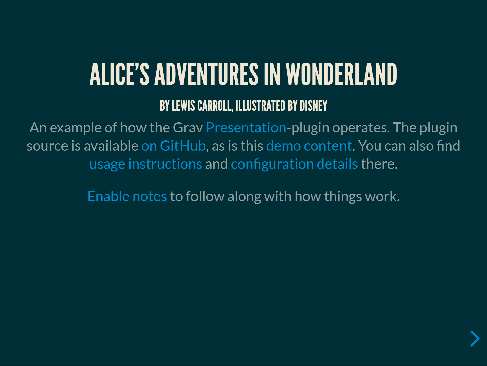

# Presentation Skeleton

## Description

The **Presentation** Plugin is an extension for [Grav CMS](http://github.com/getgrav/grav), and provides a simple way of creating fullscreen slideshows that can be navigated two-dimensionally, using the [Reveal.js](https://github.com/hakimel/reveal.js/)-library.

## Installation

Installing the Presentation-skeleton can be done by downloading the newest [release](https://github.com/OleVik/grav-skeleton-presentation/releases) and extracting it to your webserver. From there it should work without issue. The Admin-plugin is recommended for easy management and editing of content.

## Usage and Configuration

See the [plugin's repository](https://github.com/OleVik/grav-plugin-presentation/) for instruction and details.